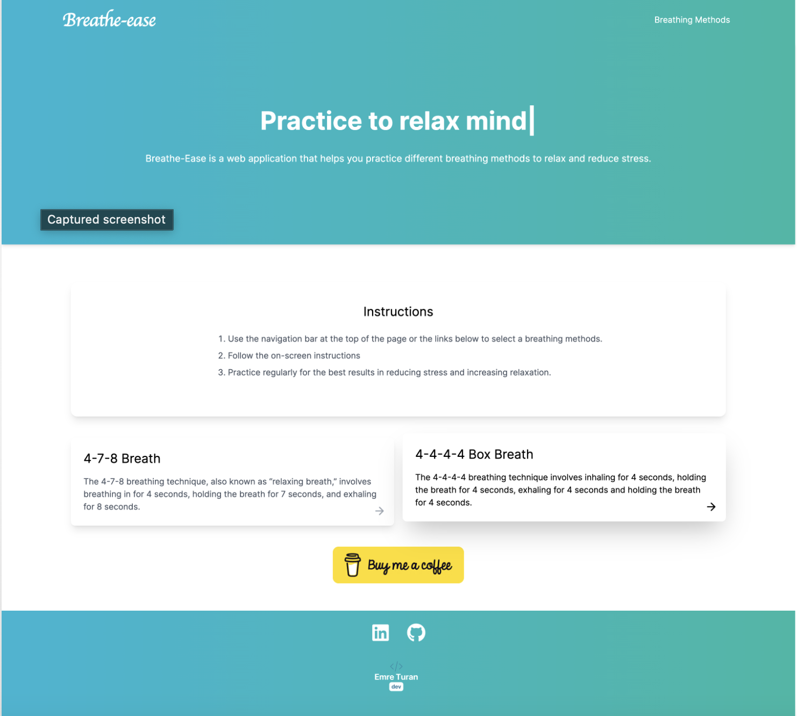

# Breathe-Ease

Breathe-Ease is a simple and user-friendly web app designed to guide you through breathing exercises that help reduce stress, improve focus, and promote relaxation.

## Benefits

Breathing exercises have numerous benefits for your overall well-being:

1. **Reduce stress**: Controlled breathing exercises can help lower cortisol levels and activate the parasympathetic nervous system, which helps the body to relax and reduce stress.
2. **Improve focus**: Focused breathing exercises can help increase mindfulness and concentration, leading to better productivity and mental clarity.
3. **Promote relaxation**: Practicing breathing exercises can help calm the mind, decrease muscle tension, and promote a state of relaxation.
4. **Boost mood**: Regularly practicing deep breathing exercises can increase the release of endorphins, the body's natural "feel-good" chemicals, which can improve mood and reduce anxiety.
5. **Strengthen the immune system**: Deep breathing exercises can help improve the circulation of oxygen throughout the body, contributing to a stronger immune system.

## Usage

To use Breathe-Ease, simply select a breathing method, follow the on-screen instructions, and start the exercise by clicking the "Start" button. The app will guide you through the inhale, hold, and exhale phases of the chosen technique, helping you maintain a consistent rhythm and focus on your breath.

## Future Features

- Dark mode for better accessibility and reduced eye strain
- Additional breathing techniques and customization options
- Mobile app version for iOS and Android
- Voice guidance
